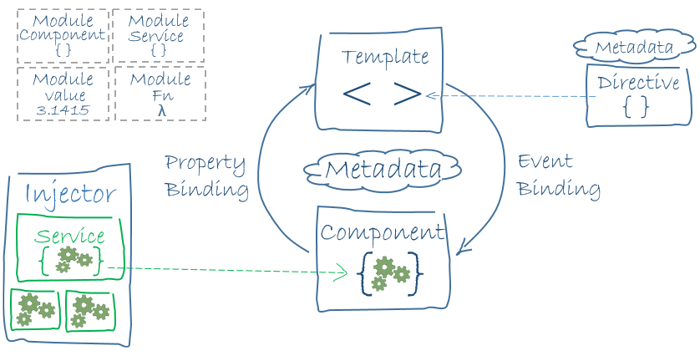
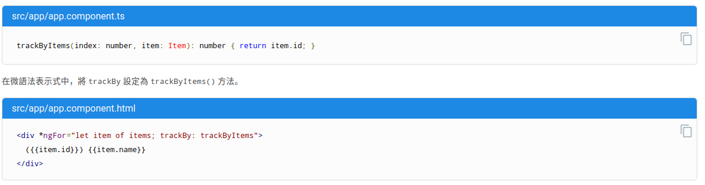
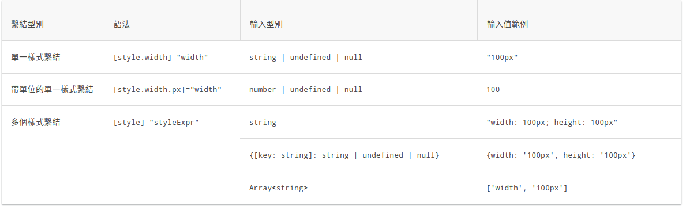
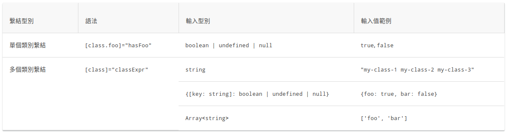
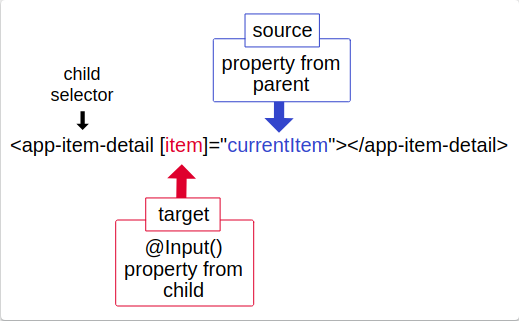
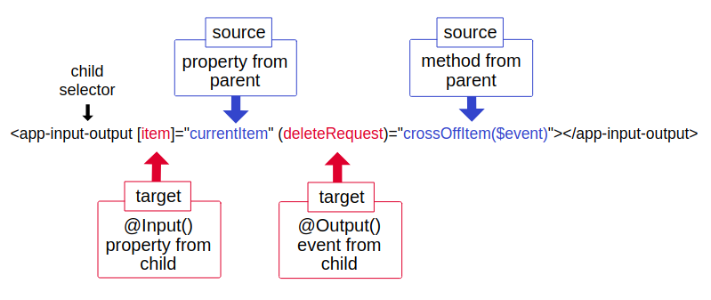
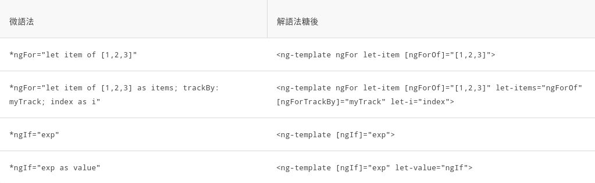
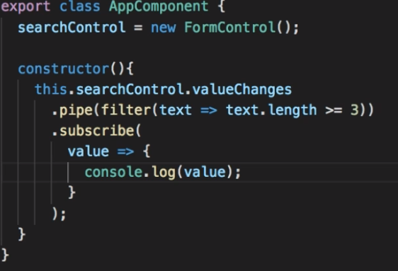
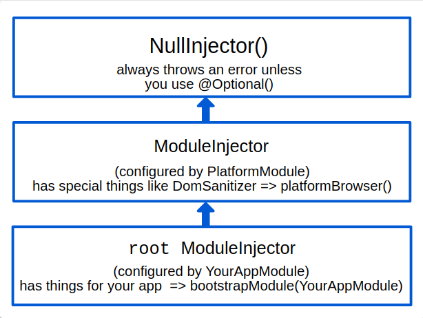
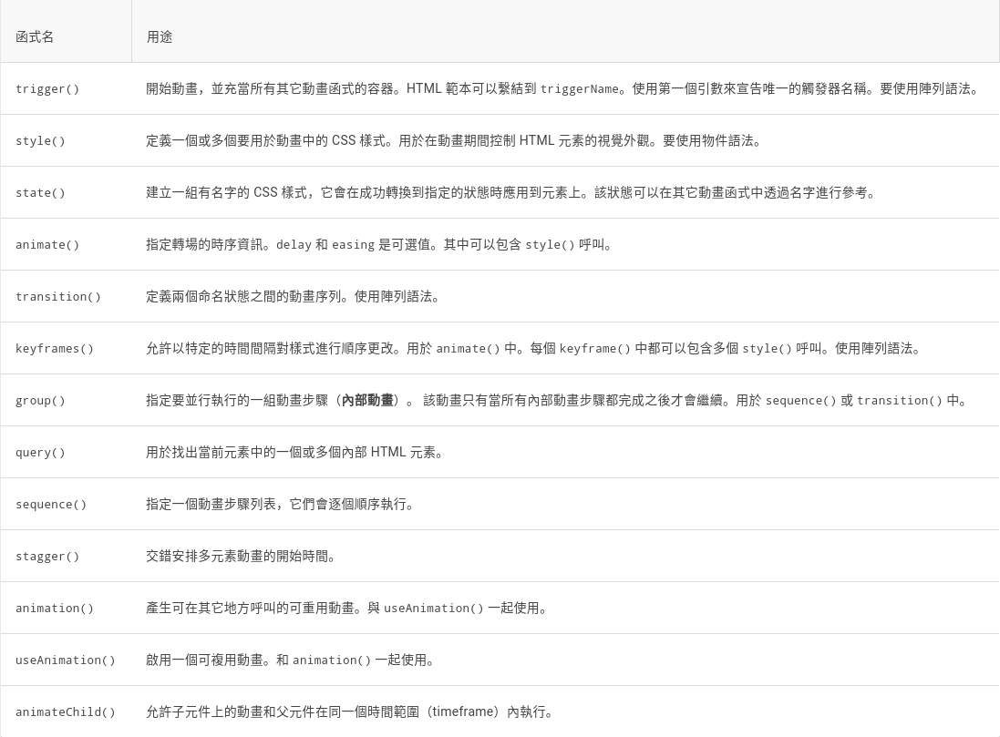

學習歷程

實習生： 廖若雅

指導主管：謝肇暐

目錄

實習第一週記錄 (11/2-11/6) ………………………. p.2-6

實習第二週記錄 (11/8-11/13) ……………………...... p.7

實習第三週記錄 (11/16-11/20)…………………... p.8-16

實習第四週記錄 (11/23-11/27) …………..…….. p.17-28

實習第五週記錄 (11/30-12/04) ………………... p.29-38

實習第六週記錄 (12/07-12/11) …………..……. p.39-58

實習第一週記錄

日期：11/2 - 11/6

學習範圍：

Angular 快速上手（實作/閱讀）

學習成果：

作品：[https://angular-7hbftk.stackblitz.io/](https://www.google.com/url?q=https://angular-7hbftk.stackblitz.io/&sa=D&ust=1611900522612000&usg=AOvVaw3oBKL9p2wLIF7eBRGUMs8Q)

筆記（如下附上）

 

個別簡述

Module:

模組化能讓你獲得
延遲載入(lazy-loading)（也就是按需載入模組）的優點，以儘可能減小啟動時需要載入的程式碼體積。

-   Ngmodule\
    Angular 的基本構成要素是 NgModule,Angular由一組NgModule定義。Root
    module (conventionally named AppModule) 衍生多個feature modules。

import { NgModule }      from '@angular/core';

  import { BrowserModule } from '@angular/platform-browser';

  import { AppComponent } from './app.component';

  @NgModule({

    imports:      [ BrowserModule ],

    providers:    [ Logger ],

    // 本模組向全域性服務中貢獻的那些服務的建立器。
這些服務能被本應用中的  

         任何部分使用。

    declarations: [ AppComponent ],

   // 那些屬於本 NgModule 的元件、指令、管道。

    exports:      [ AppComponent ],

    bootstrap:    [ AppComponent ]

   //
應用的主檢視，稱為根元件。它是應用中所有其它檢視的宿主。只有根模組才

       應該設定這個 bootstrap 屬性。

   })

  export class AppModule { }

// \* Component 定義 views
用來處理視覺，也可使用service，而service可以作為dependencies被注入到元件中以此模組化程式碼。

-   Decorator\
    The metadata for a component class associates it with a template （
    defines a view ）.\
    template 把普通的 HTML 和 Angular
    指令與繫結標記（markup）組合起來，這樣 Angular 就可以在渲染 HTML
    之前先修改這些 HTML。

-   template 中的指令會提供程式邏輯，而繫結標記 (markup)
    會把你應用中的資料和 DOM 連線在一起。 大概有兩種型別的資料繫結：\
    (1) Event binding: 更新應用的資料來響應目標環境下的使用者輸入。\
    (2) Property binding: 將從應用資料中計算出來的值插入到 HTML 中
    （類似將計算值差入react中的props概念）\
    -\> Angular 有雙向資料繫結\
      Conclusion: 有別於react，angular像是一個處理HTML的指令。 

Component:

每個 Angular 應用都至少有一個元件，也就是 root
component，它會把元件樹和頁面中的 DOM 連線起來。\
每個元件都會定義一個 class，其中包含應用的資料和邏輯 (data and
logic)，並與一個 HTML template 相關聯，該 template
定義了一個供目標環境下顯示的 view。

-   @Component()\
    裝飾器表明緊隨它的那個類別是一個元件，並提供範本和該元件專屬的元資料。

@Component({

  selector:    'app-hero-list',

  // 是一個 CSS 選擇器，它會告訴 Angular，一旦在範本 HTML
中找到了這個選擇器對應的標籤，就建立並插入該元件的一個實例。

  templateUrl: './hero-list.component.html',

  // 該元件的 HTML 範本檔案相對於這個元件檔案的地址。

  providers:  [ HeroService ]

})

export class HeroListComponent implements OnInit {

  heroes: Hero[];

  selectedHero: Hero;

  constructor(private service: HeroService) { }

  ngOnInit() {

    this.heroes = this.service.getHeroes();

  }

  //ngOnInit() 是一個生命週期鉤子，Angular 在建立完元件後很快就會呼叫
ngOnInit()。這裡是放置初始化邏輯的好地方。

  selectHero(hero: Hero) { this.selectedHero = hero; }

}

簡易範例

1.

\<h2\>Hero List\</h2\>

\<p\>\<i\>Pick a hero from the list\</i\>\</p\>

\<ul\>

  \<li \*ngFor="let hero of heroes" (click)="selectHero(hero)"\>

    {{hero.name}}

  \</li\>

\</ul\>

\<app-hero-detail \*ngIf="selectedHero"
[hero]="selectedHero"\>\</app-hero-detail\>

Summary:\
{{[hero.name](https://www.google.com/url?q=http://hero.name/&sa=D&ust=1611900522621000&usg=AOvVaw09gsjI9nrfO-7pDx9819y9)}}
這個插值在 “li” 標籤中顯示元件的
[hero.name](https://www.google.com/url?q=http://hero.name/&sa=D&ust=1611900522621000&usg=AOvVaw09gsjI9nrfO-7pDx9819y9) 屬性的值。

[hero]屬性繫結把父元件 HeroListComponent 的 selectedHero 的值傳到子元件
HeroDetailComponent 的 hero 屬性中。

當用戶點選某個英雄的名字時，(click) 事件繫結會呼叫元件的 selectHero
方法。

2.

 \<input [(ngModel)]="hero.name"\> 

Summary:\
在雙向繫結中，資料屬性值透過屬性繫結從元件流到輸入框。使用者的修改透過事件繫結流回元件，把屬性值設定為最新的值。

Angular 在每個 JavaScript
事件迴圈中處理所有的資料繫結，它會從元件樹的根部開始，遞迴處理全部子元件。

指令

-   結構型指令\
    特色：使用 \* （星號）\
    結構型指令透過新增、移除或替換 DOM 元素來修改佈局。
    這個範例範本使用了兩個內建的結構型指令來為要渲染的檢視新增程式邏輯：

\<li \*ngFor="let hero of heroes"\>\</li\>

\<app-hero-detail \*ngIf="selectedHero"\>\</app-hero-detail\>

\*ngFor 是一個迭代器，它要求 Angular 為 heroes
列表中的每個英雄渲染出一個 “li” 。

\*ngIf 是個條件語句，只有當選中的英雄存在時，它才會包含 HeroDetail
元件。

-   屬性型指令\
    屬性型指令會修改現有元素的外觀或行為。
    在範本中，它們看起來就像普通的 HTML
    屬性一樣，因此得名“屬性型指令”。ngModel
    指令就是屬性型指令的一個例子，它實現了雙向資料繫結。 ngModel
    修改現有元素（一般是 \<input\>）的行為：設定其顯示屬性值，並響應
    change 事件。

 \<input [(ngModel)]="hero.name"\> 

-\> Angular 還有很多預定義指令，有些修改佈局結構（比如
ngSwitch），有些修改 DOM 元素和元件的樣子（比如 ngStyle 和 ngClass）。

Service:

​(1) 對於與特定檢視無關並希望跨元件共享的資料或邏輯，可以建立服務類別。\
-\>
可以把這裡的service想像成react裡持有動態運算的state的概念，我們把要共享的服務獨立出來。\
(2) 依賴注入（或 DI）:\
讓你可以保持元件類別的精簡和高效。有了
DI，元件就不用從伺服器獲取資料、驗證使用者輸入或直接把日誌寫到控制檯，而是會把這些任務委託給服務。

-   @Injectable()\
    服務類別的定義通常緊跟在此裝飾器之後。該裝飾器提供的 metadata
    可以讓你的服務作為dependencies 被注入到客戶元件中。

Router:

Angular 的 Router
模組提供了一個服務，它可以讓你定義在應用的各個不同狀態和檢視層次結構之間導航時要使用的路徑。\
navigation，url，導覽

架構 Summary 圖

Together, a component and template define an Angular view.

A decorator on a component class adds the metadata, including a pointer
to the associated template.\
-\> decorator 裝在class上 加上metadata 指標指向相關template

Directives and binding markup in a component’s template modify views
based on program data and logic.\
-\> directives 綁markup在component的template上（template更改基於program
data & logic的views）

The dependency injector provides services to a component, such as the
router service that lets you define navigation among views.\
-\> dependency injector 提供服務給component像是router（提供導引的router)

-   Metadata

Metadata is used to decorate the class so that it can configure the
expected behavior of a class. Decorators are the core concept when
developing with Angular (versions 2 and above). The user can use
metadata to a class to tell Angular app that AppComponent is the
component. Metadata can be attached to the TypeScript using the
decorator.

@Component({ selector: ‘app-root’, templateUrl: ‘./app.component.html’,
styleUrls: [’./app.component.css’] })

@Component is a decorator which makes use of configuration object to
create the component and its view.

實習第二週記錄

日期：11/8 - 11/13

學習範圍：

Angular課程：英雄指南 （實作）

學習成果：

實作code:        

https://github.com/royal0721/royal0721.github.io 

實作Demo:         

https://youtu.be/BatLj9A8xc4

實習第三週記錄

日期：11/16 - 11/20

學習範圍：

Angular 基礎知識：Binding / Ng 系列 Module / Input & Output

學習成果：

筆記（如下附上）

總體詳述

顯示資料

-   注意事項:\
    插值{{ }}中的加減乘除使用需要注意以下幾點：

（1) 不能使用那些具有或可能引發副作用的 JavaScript 表示式，包括：

  賦值 (=, +=, -=, ...)

  new、typeof、instanceof 等運算子。

  使用 ; 或 , 串聯起來的表示式

  自增和自減運算子：++ 和 --

  一些 ES2015+ 版本的運算子

帶 trackBy 的 \*ngFor：

trackBy讓人更有效率地使用\*ngFor：

你可以使用 trackBy 來讓它更加高效。向該元件新增一個方法，該方法返回
NgFor 應該追蹤的值。這個例子中，該值是英雄的 id。如果 id
已經被渲染，Angular 就會追蹤它，而不會重新向伺服器查詢相同的 id。\

上圖詳細文字：

-   src/app/app.component.ts

trackByItems(index: number, item: Item): number { return item.id; }

-   src/app/app.component.html

\

  ({{item.id}}) {{item.name}}

\</div\>

屬性繫結與插值

通常差別不大，兩者在渲染字串時插值的可讀性更佳。\
但將元素屬性設定為非字串的資料值時，必須使用屬性繫結。

// 此為兩者皆可的例子

\<p\>\ is the \<i\>interpolated\</i\>
image.\</p\>

\<p\>\ is the \<i\>property bound\</i\>
image.\</p\>

\<p\>\<span\>"{{interpolationTitle}}" is the \<i\>interpolated\</i\>
title.\</span\>\</p\>

\<p\>"\\</span\>" is the
\<i\>property bound\</i\> title.\</p\>

繫結語法：

1.  資料來源 -\> 檢視\
    資料繫結使用 DOM 元素、元件和指令的 Property，而不是 HTML
    的Attribute。\
    Property 值可以改變；Attribute 值則不能。\
    

\<input [disabled] = "condition ? true : false"\>

-   Property 類別：

元素的 property\
元件的 property\
指令的 property

Sample code:

\

\<app-hero-detail [hero]="currentHero"\>\</app-hero-detail\>

\
\</div\>\`

若要使用attribute繫結，寫法應為如下：

\<!-- create and set an aria attribute for assistive technology --\>

\<button [attr.aria-label]="actionName"\>{{actionName}} with
Aria\</button\>

而非：

\<tr\>\<td colspan="{{1 + 1}}"\>Three-Four\</td\>\</tr\>

錯誤部份可改為：

\<!-- Notice the colSpan property is camel case --\>

\<tr\>\<td [colSpan]="1 + 1"\>Three-Four\</td\>\</tr\>

-   css類型與樣式繫結

某個類別或樣式繫結越具體，它的優先順序就越高。\
\

2.  檢視 -\> 資料來源

事件繫結

 \<button (click)="onSave(\$event)"\>Save\</button\> 

// This component makes a request but it can't actually delete a hero.

@Output() deleteRequest = new EventEmitter\<Item\>();

delete() {

  this.deleteRequest.emit(this.item);

  this.displayNone = this.displayNone ? '' : 'none';

  this.lineThrough = this.lineThrough ? '' : 'line-through';

}

3.  雙向：檢視 \<-\> 資料來源

-   功能有二：

-   設定特定的元素屬性。
-   監聽元素的變更事件。

範例（三個一起看）：

    import { Component, Input, Output, EventEmitter } from
'@angular/core';

    @Component({

      selector: 'app-sizer',

      templateUrl: './sizer.component.html',

      styleUrls: ['./sizer.component.css']

    })

   

    export class SizerComponent {

      @Input()  size: number | string;

      @Output() sizeChange = new EventEmitter\<number\>();

      dec() { this.resize(-1); }

      inc() { this.resize(+1); }

      resize(delta: number) {

        this.size = Math.min(40, Math.max(8, +this.size + delta));

        this.sizeChange.emit(this.size);

      }

    }

   

    \<div\>

      \<button (click)="dec()" title="smaller"\>-\</button\>

      \<button (click)="inc()" title="bigger"\>+\</button\>

      \<label [style.font-size.px]="size"\>FontSize:
{{size}}px\</label\>

    \</div\>

\<app-sizer [(size)]="fontSizePx"\>\</app-sizer\>

\
Resizable Text\</div\>

-\> 兩層包裹：設定屬性，監聽變更。

Event binding

\<input [value]="currentItem.name"

       (input)="currentItem.name=\$event.target.value" \>

EventEmiter

在使用 EventEmitter時，最需要注意的是以下幾點：

-   Do NOT count on EventEmitter continuing to be an Observable!
-   Do NOT count on those Observable operators being there in the
    future!
-   These will be deprecated soon and probably removed before release.
-   Use EventEmitter only for event binding between a child and parent
    component. Do not subscribe to it. Do not call any of those methods.
    Only call eve.emit()

以下為正確用法：

@Component({

    selector : 'child',

    template : \`

        \<button (click)="sendNotification()"\>Notify my
parent!\</button\>

    \`

})

class Child {

    @Output() notifyParent: EventEmitter = new EventEmitter();

    sendNotification() {

        this.notifyParent.emit('Some value to send to the parent');

    }

}

@Component({

    selector : 'parent',

    template : \`

        \<child (notifyParent)="getNotification(\$event)"\>\</child\>

    \`

})

class Parent {

    getNotification(evt) {

        // Do something with the notification (evt) sent by the child!

    }

}

內建指令

常見三大指令

NgClass —— 新增和刪除一組 CSS 類別。

\<input id="chk\_{{item.id}}" type="checkbox" [checked]="item.done"

(click)="itemClick(item)"\>

\{{ item.value }}\</span\>

NgStyle —— 新增和刪除一組 HTML 樣式。

-   單樣式指令

\

 This div is x-large or smaller.

\</div\>\`

-   多項樣式指令

currentStyles: {};

setCurrentStyles() {

 // CSS styles: set per current state of component properties

 this.currentStyles = {

   'font-style':  this.canSave      ? 'italic' : 'normal',

   'font-weight': !this.isUnchanged ? 'bold'   : 'normal',

   'font-size':   this.isSpecial    ? '24px'   : '12px'

 };

}

\

  This div is initially italic, normal weight, and extra large (24px).

\</div\>

NgModel —— 將資料雙向繫結新增到 HTML 表單元素。

-   首先，需要 import { FormsModule } from ‘@angular/forms’ 在
    app.module.ts;

\<label
for="example-change"\>(ngModelChange)="...name=\$event":\</label\>

\<input [ngModel]="hero.name" (ngModelChange)="hero.name=\$event"
id="example-change"\>

內建結構型指令

常見三大指令

-   注意事項：

1.  為什麼在要指令名稱前加上星號（\*）。
2.  當指令沒有合適的宿主元素時，使用 \<ng-container\> 對元素進行分組。
3.  只能往一個元素上應用一個結構型指令。

NgIf —— 從範本中建立或銷燬子檢視。

NgIf 工作方式有所不同。如果 NgIf 為 false，則 Angular 將從 DOM
中刪除該元素及其後代。這銷燬了它們的元件，釋放了資源，從而帶來更好的使用者體驗。

如果要隱藏大型元件樹，請考慮使用 NgIf 作為顯示/隱藏的更有效替代方法。

\<app-item-detail \*ngIf="isActive" [item]="item"\>\</app-item-detail\>

NgFor —— 為列表中的每個條目重複渲染一個節點。

\
{{i + 1}} -
{{item.name}}\</div\>

NgSwitch —— 一組在備用檢視之間切換的指令。

\

  \<app-stout-item    \*ngSwitchCase="'stout'"  
 [item]="currentItem"\>\</app-stout-item\>

  \<app-device-item   \*ngSwitchCase="'slim'"    
[item]="currentItem"\>\</app-device-item\>

  \<app-lost-item     \*ngSwitchCase="'vintage'"
 [item]="currentItem"\>\</app-lost-item\>

  \<app-best-item     \*ngSwitchCase="'bright'"  
[item]="currentItem"\>\</app-best-item\>

\<!-- . . . --\>

  \<app-unknown-item  \*ngSwitchDefault          
[item]="currentItem"\>\</app-unknown-item\>

\</div\>

Form 問題

-   帶有 NgForm 時，itemForm 就是對 NgForm
    指令的參考，它能夠追蹤表單中每個控制元件的值和有效性\
    妥善解決了 Form 本身的有效性問題

\<form \#itemForm="ngForm" (ngSubmit)="onSubmit(itemForm)"\>

  \<label for="name"\>

  Name

  \<input class="form-control" name="name" ngModel required /\>

  \</label\>

  \<button type="submit"\>Submit\</button\>

\</form\>

\

  \<p\>{{ submitMessage }}\</p\>

\</div\>

-   變數部份可以用 ref- 字首代替 \#
-   關鍵字的差別：

1.  let 關鍵字：單一實例
2.  \#var: 整個範本的任意位置訪問

@Input() @Output() 輸入及輸出屬性問題

Intro of @input() and @output()：

@Input() :
輸入屬性，通常為接收數據資料，也就是就是讓Parent將資料傳送到Child中使用。

@Output() :
輸出屬性，通常提供事件給外部呼叫回傳使用，也就是讓Child將資料傳回Parent中使用。

@Input() 說明：

-   子元件

import { Component, Input } from '@angular/core'; // First, import Input

export class ItemDetailComponent {

  @Input() item: string; // decorate the property with @Input()

}

\<p\>

  Today's item: {{item}}

\</p\>

-   父元件

export class AppComponent {

  currentItem = 'Television';

}

 \<app-item-detail [item]="currentItem"\>\</app-item-detail\> 

-   舉例說明：

\<child\_selector [input property from child]= “property from
parent”\>\</child\_selector\>

（！！）生命鉤子：OnChange -\> 監視 @Input() 屬性的更改

@Input() hero: Hero;

@Input() power: string;

\<on-changes [hero]="hero" [power]="power"\>\</on-changes\>

@Output() 說明：

@Output()
將子元件中的屬性標記為一扇門，資料可以透過這扇門從子元件傳到父元件。
然後，子元件必須引發一個事件，以便父元件知道發生了某些變化。為了引發事件，@Output()
要和 EventEmitter 配合使用，EventEmitter 是 @angular/core
中的一個類別，用於發出自訂事件。

-   子元件

import { Output, EventEmitter } from '@angular/core';

export class ItemOutputComponent {

  @Output() newItemEvent = new EventEmitter\<string\>();

  addNewItem(value: string) {

    this.newItemEvent.emit(value);

  }

}

\<label\>Add an item: \<input \#newItem\>\</label\>

\<button (click)="addNewItem(newItem.value)"\>Add to parent's
list\</button\>

-   父元件

export class AppComponent {

  items = ['item1', 'item2', 'item3', 'item4'];

  addItem(newItem: string) {

    this.items.push(newItem);

  }

}

 \<app-item-output
(newItemEvent)="addItem(\$event)"\>\</app-item-output\> 

-   @Input() 和 @Output() 一起\
    

@Input('wishListItem') input2: string; //  @Input(alias)

@Output('wishEvent') outputEvent2 = new EventEmitter\<string\>(); //
 @Output(alias) propertyName = ...

實習第四週記錄

日期：11/23 - 11/27

學習範圍：

Angular 基礎知識：Pipe / Form

學習成果：

筆記（如下附上）

管道運算子 （|）（?）（!）

-   （|）pipe operator

\<p\>Manufacture date with date format pipe:

{{item.manufactureDate | date:'longDate'}}\</p\>

 \<p\>Title through uppercase pipe: {{title | uppercase}}\</p\> 

-   （?）pipe operator:

-   Angular 安全導航運算子 ? 可以對在屬性路徑中出現 null 和 undefined
    值進行保護。

\<p\>The item name is: {{item?.name}}\</p\>

-   （!）pipe operator:

-   如果無法在執行型別檢查器期間確定變數是否 null 或
    undefined，則會丟擲錯誤。你可以透過應用字尾非空斷言運算子!來告訴型別檢查器不要丟擲錯誤。
-   嚴格空值檢測：\
    與安全導航運算子不同的是，非空斷言運算子不會防止出現 null 或
    undefined。 它只是告訴 TypeScript
    的型別檢查器對特定的屬性表示式，不做 “嚴格空值檢測”。

使用 PipeTransform 介面-自定義Pipe

import { Pipe, PipeTransform } from '@angular/core';

/\*

 \* Raise the value exponentially

 \* Takes an exponent argument that defaults to 1.

 \* Usage:

 \*   value | exponentialStrength:exponent

 \* Example:

 \*   {{ 2 | exponentialStrength:10 }}

 \*   formats to: 1024

\*/

@Pipe({name: 'exponentialStrength'})

export class ExponentialStrengthPipe implements PipeTransform {

  transform(value: number, exponent?: number): number {

    return Math.pow(value, isNaN(exponent) ? 1 : exponent);

  }

}

純管道 V.S. 非純管道

① 純管道:

Angular只有檢查到輸入值發生純變更時，才會執行純管道。純變更指的是，原始型別值(String,Number,Boolean,Symbol)的改變，或者物件引用的改變(物件值改變不是純變更，不會執行).

② 非純管道

Angular會在每個元件的變更檢測週期執行非純管道。所以，如果使用非純管道，我們就得注意效能問題了。

-   非純管道

@Pipe({

  name: 'flyingHeroesImpure',

  pure: false

})

\$any()

([https://ithelp.ithome.com.tw/articles/10205173](https://www.google.com/url?q=https://ithelp.ithome.com.tw/articles/10205173&sa=D&ust=1611900522660000&usg=AOvVaw39fQ7SYJ-SZX0ltVd3DQ3T))

微語法的拆解

\<ng-template\> - comment 語法

\<ng-container\> 是一個分組元素，但它不會汙染樣式或元素佈局，因為
Angular 壓根不會把它放進 DOM 中。

TemplateRef

TemplateRef取得 \<ng-template\>
的內容，並透過ViewContainerRef來訪問這個檢視容器。

constructor(

  private templateRef: TemplateRef\<any\>,

  private viewContainer: ViewContainerRef) { }

  )

@Input() set appUnless(condition: boolean) {

  if (!condition && !this.hasView) {

    this.viewContainer.createEmbeddedView(this.templateRef);

    this.hasView = true;

  } else if (condition && this.hasView) {

    this.viewContainer.clear();

    this.hasView = false;

  }

}

-   一旦該值的條件發生了變化，Angular 就會去設定 appUnless
    屬性。因為不能用 appUnless
    屬性，所以你要為它定義一個設定器（setter）。
-   如果條件為假，並且以前尚未建立過該檢視，就告訴檢視容器（ViewContainer）根據範本建立一個內嵌檢視。
-   如果條件為真，並且檢視已經顯示出來了，就會清除該容器，並銷燬該檢視。

Complete:

import { Directive, Input, TemplateRef, ViewContainerRef } from
'@angular/core';

/\*\*

 \* Add the template content to the DOM unless the condition is true.

 \*/

@Directive({ selector: '[appUnless]'})

export class UnlessDirective {

  private hasView = false;

  constructor(

    private templateRef: TemplateRef\<any\>,

    private viewContainer: ViewContainerRef) { }

  @Input() set appUnless(condition: boolean) {

    if (!condition && !this.hasView) {

      this.viewContainer.createEmbeddedView(this.templateRef);

      this.hasView = true;

    } else if (condition && this.hasView) {

      this.viewContainer.clear();

      this.hasView = false;

    }

  }

}

\

  (A) This paragraph is displayed because the condition is false.

\</p\>

\

  (B) Although the condition is true,

  this paragraph is displayed because appUnless is set to false.

\</p\>

生命週期鉤子

ngOnInit() / ngOnDestroy() 

// Spy on any element to which it is applied.

// Usage: \
...\</div\>

@Directive({selector: '[mySpy]'})

export class SpyDirective implements OnInit, OnDestroy {

  constructor(private logger: LoggerService) { }

  ngOnInit()    { this.logIt(\`onInit\`); }

  ngOnDestroy() { this.logIt(\`onDestroy\`); }

  private logIt(msg: string) {

    this.logger.log(\`Spy \#\${nextId++} \${msg}\`);

  }

}

\

  {{hero}}

\</div\>

使用變更的鉤子

ngOnChanges(changes: SimpleChanges) {

  for (let propName in changes) {

    let chng = changes[propName];

    let cur  = JSON.stringify(chng.currentValue);

    let prev = JSON.stringify(chng.previousValue);

    this.changeLog.push(\`\${propName}: currentValue = \${cur},
previousValue = \${prev}\`);

  }

}

子檢視中，帶@ViewChild裝飾器的屬性來訪問子檢視

export class AfterViewComponent implements  AfterViewChecked,
AfterViewInit {

  private prevHero = '';

  // Query for a VIEW child of type \`ChildViewComponent\`

  @ViewChild(ChildViewComponent) viewChild: ChildViewComponent;

  ngAfterViewInit() {

    // viewChild is set after the view has been initialized

    this.logIt('AfterViewInit');

    this.doSomething();

  }

  ngAfterViewChecked() {

    // viewChild is updated after the view has been checked

    if (this.prevHero === this.viewChild.hero) {

      this.logIt('AfterViewChecked (no change)');

    } else {

      this.prevHero = this.viewChild.hero;

      this.logIt('AfterViewChecked');

      this.doSomething();

    }

  }

  // ...

}

響應被投影內容的變更 - AfterContentInit() 和 AfterContentChecked()

-   (!!)永遠不要在元件標籤的內部放任何內容 ——
    除非你想把這些內容投影進這個元件中。
-   只能透過帶有 @ContentChild 裝飾器的屬性來查詢到“子級內容”

export class AfterContentComponent implements AfterContentChecked,
AfterContentInit {

  private prevHero = '';

  comment = '';

  // Query for a CONTENT child of type \`ChildComponent\`

  @ContentChild(ChildComponent) contentChild: ChildComponent;

  ngAfterContentInit() {

    // contentChild is set after the content has been initialized

    this.logIt('AfterContentInit');

    this.doSomething();

  }

  ngAfterContentChecked() {

    // contentChild is updated after the content has been checked

    if (this.prevHero === this.contentChild.hero) {

      this.logIt('AfterContentChecked (no change)');

    } else {

      this.prevHero = this.contentChild.hero;

      this.logIt('AfterContentChecked');

      this.doSomething();

    }

  }

}

元件互動

[https://angular.tw/guide/component-interaction](https://www.google.com/url?q=https://angular.tw/guide/component-interaction&sa=D&ust=1611900522674000&usg=AOvVaw21FOLoXbeOJxMn_olNM9__)\
官網實例

元件樣式

1.  host\
    使用 :host
    偽類別選擇器，用來選擇元件宿主元素中的元素（相對於元件範本內部的元素）。

:host {

  display: block;

  border: 1px solid black;

}

1-1. host(.active)\
下一個例子再次把宿主元素作為目標，但是只有當它同時帶有 active CSS
類別的時候才會生效。

:host(.active) {

  border-width: 3px;

}

2.  :host-context\
    它在當前元件宿主元素的祖先節點中查詢 CSS 類別，
    直到文件的根節點為止。在與其它選擇器組合使用時，它非常有用。

:host-context(.theme-light) h2 {

 

 background-color: \#eef;

  }

Angular 元素

建立表單

FormControl 響應表單

-   透過輸入元素上的 [formControl]
    指令，在任何給定的時間點提供表單元素的值和狀態。

import { Component } from '@angular/core';

  import { FormControl } from '@angular/forms';

  @Component({

    selector: 'app-reactive-favorite-color',

    template: \`

    Favorite Color: \<input type="text"    

    [formControl]="favoriteColorControl"\>

    \`

  })

 export class FavoriteColorComponent {

   favoriteColorControl = new FormControl('');

 }

FormControl and NgModel

-   範本驅動表單中對表單模型的間接訪問

import { Component } from '@angular/core';

@Component({

  selector: 'app-template-favorite-color',

  template: \`

    Favorite Color: \<input type="text" [(ngModel)]="favoriteColor"\>

  \`

})

export class FavoriteColorComponent {

  favoriteColor = '';

}

表單元件

表單組

定義了一個帶有一組控制元件的表單，把它們放在一起管理，可以透過巢狀表單組來建立更復雜的表單。

import { Component } from '@angular/core';

import { FormGroup, FormControl } from '@angular/forms';

@Component({

  selector: 'app-profile-editor',

  templateUrl: './profile-editor.component.html',

  styleUrls: ['./profile-editor.component.css']

})

export class ProfileEditorComponent {

  profileForm = new FormGroup({

    firstName: new FormControl(''),

    lastName: new FormControl(''),

    address: new FormGroup({

      street: new FormControl(''),

      city: new FormControl(''),

      state: new FormControl(''),

      zip: new FormControl('')

    })

  });

}

\

  \<h3\>Address\</h3\>

  \<label\>

    Street:

    \<input type="text" formControlName="street"\>

  \</label\>

  \<label\>

    City:

    \<input type="text" formControlName="city"\>

  \</label\>

 

  \<label\>

    State:

    \<input type="text" formControlName="state"\>

  \</label\>

  \<label\>

    Zip Code:

    \<input type="text" formControlName="zip"\>

  \</label\>

\</div\>

FormBuilder

在幕後也使用同樣的方式來建立和返回這些實例。

import { Component } from '@angular/core';

import { FormBuilder } from '@angular/forms';

import { Validators } from '@angular/forms'; //表單驗證

@Component({

  selector: 'app-profile-editor',

  templateUrl: './profile-editor.component.html',

  styleUrls: ['./profile-editor.component.css']

})

export class ProfileEditorComponent {

  profileForm = this.fb.group({

    firstName: [''],

    lastName: [''],

    address: this.fb.group({

      street: [''],

      city: [''],

      state: [''],

      zip: ['']

    }),

  });

  constructor(private fb: FormBuilder) { }

}

表單陣列 - 動態表單

定義了一個動態表單，可以在執行時新增和刪除控制元件，也可以透過巢狀表單陣列來建立更復雜的表單。

FormArray 類別

-   Getter

-   相對於重複使用 profileForm.get() 方法獲取每個實例的方式，getter
    可以讓你輕鬆訪問表單陣列各個實例中的別名。
    表單陣列實例用一個數組來代表未定數量的控制元件。透過 getter
    來訪問控制元件很方便，這種方法還能很容易地重複處理更多控制元件。

使用 getter 語法建立類別屬性
aliases，以從父表單組中接收表示綽號的表單陣列控制元件。

import { FormArray } from '@angular/forms';

profileForm = this.fb.group({

  firstName: ['', Validators.required],

  lastName: [''],

  address: this.fb.group({

    street: [''],

    city: [''],

    state: [''],

    zip: ['']

  }),

  aliases: this.fb.array([

    this.fb.control('')

  ])

});

get aliases() {

  return this.profileForm.get('aliases') as FormArray;

}

addAlias() {

  this.aliases.push(this.fb.control(''));

}

\

  \<h3\>Aliases\</h3\> \<button (click)="addAlias()"\>Add
Alias\</button\>

  \

    \<!-- The repeated alias template --\>

    \<label\>

      Alias:

      \<input type="text" [formControlName]="i"\>

    \</label\>

  \</div\>

\</div\>

驗證 Validators

ngOnInit(): void {

  this.heroForm = new FormGroup({

    'name': new FormControl(this.hero.name, [

      Validators.required,

      Validators.minLength(4),

      forbiddenNameValidator(/bob/i)

      // \<-- Here's how you pass in the custom validator.

    ]),

    'alterEgo': new FormControl(this.hero.alterEgo),

    'power': new FormControl(this.hero.power,

     Validators.required)

  });

}

get name() { return this.heroForm.get('name'); }

get power() { return this.heroForm.get('power'); }

\<input id="name" class="form-control"

formControlName="name" required \>

\

  \

    Name is required.

  \</div\>

  \

    Name must be at least 4 characters long.

  \</div\>

  \

    Name cannot be Bob.

  \</div\>

\</div\>

自定驗證器（forbidden-name.directive.ts）

1.  先考慮前面的響應式式表單中的 forbiddenNameValidator 函式。

export function forbiddenNameValidator(nameRe: RegExp): ValidatorFn {

  return (control: AbstractControl): {[key: string]: any} |  

  null =\> {

    const forbidden = nameRe.test(control.value);

    return forbidden ? {'forbiddenName': {value:

  control.value}} : null;

  };

}

2.  把自訂驗證器新增到響應式表單中

this.heroForm = new FormGroup({

  'name': new FormControl(this.hero.name, [

    Validators.required,

    Validators.minLength(4),

    forbiddenNameValidator(/bob/i) // \<-- Here's how you pass in the
custom validator.

  ]),

  'alterEgo': new FormControl(this.hero.alterEgo),

  'power': new FormControl(this.hero.power, Validators.required)

});

3.  把provider記在directive.ts中

@Directive({

  selector: '[appForbiddenName]',

  providers: [{provide: NG\_VALIDATORS, useExisting:
ForbiddenValidatorDirective, multi: true}]

})

export class ForbiddenValidatorDirective implements Validator {

  @Input('appForbiddenName') forbiddenName: string;

  validate(control: AbstractControl): {[key: string]: any} | null {

    return this.forbiddenName ? forbiddenNameValidator(new
RegExp(this.forbiddenName, 'i'))(control)

                              : null;

  }

}

\<input id="name" name="name" class="form-control"

      required minlength="4" appForbiddenName="bob"

      [(ngModel)]="hero.name" \#name="ngModel" \>

控制元件狀態的css類別

.ng-valid

.ng-invalid

.ng-pending

.ng-pristine

.ng-dirty

.ng-untouched

.ng-touched

ex.

.ng-valid[required], .ng-valid.required  {

 border-left: 5px solid \#42A948; /\* green \*/

 }

  .ng-invalid:not(form)  {

   border-left: 5px solid \#a94442; /\* red \*/

   }

交叉驗證

-   跨欄位交叉驗證器是一種自訂驗證器，可以對表單中不同欄位的值進行比較，並針對它們的組合進行接受或拒絕。

const heroForm = new FormGroup({

  'name': new FormControl(),

  'alterEgo': new FormControl(),

  'power': new FormControl()

   }, { validators: identityRevealedValidator });

-   directives

export const identityRevealedValidator: ValidatorFn = (control:
FormGroup): ValidationErrors | null =\> {

  const name = control.get('name');

  const alterEgo = control.get('alterEgo');

  return name && alterEgo && name.value === alterEgo.value ? {  

  'identityRevealed': true } : null;

  };

@Directive({

  selector: '[appIdentityRevealed]',

  providers: [{ provide: NG\_VALIDATORS, useExisting:  

  IdentityRevealedValidatorDirective, multi: true }]

  })

  export class IdentityRevealedValidatorDirective implements  

  Validator {

    validate(control: AbstractControl): ValidationErrors {

    return identityRevealedValidator(control)

  }

  }

-   html

\

    Name cannot match alter ego.

\</div\>

\<form \#heroForm="ngForm" appIdentityRevealed\>

非同步驗證器（目前還沒用到）

[https://angular.tw/guide/form-validation](https://www.google.com/url?q=https://angular.tw/guide/form-validation&sa=D&ust=1611900522699000&usg=AOvVaw0SWwIbUE1DyhBIagOdf1QM)

實習第五週記錄

日期：11/30 - 12/04

學習範圍：

Angular 基礎知識：Observable / NgModule

學習成果：

筆記（如下附上）

Observable

-   datastream 的流程\
    該模式和發佈/訂閱模式非常相似（但不完全一樣）
-   作為發佈者，你建立一個 Observable
    的實例，其中定義了一個訂閱者（subscriber）函式。 當有消費者呼叫
    subscribe() 方法時，這個函式就會執行。
    訂閱者函式用於定義“如何獲取或產生那些要發佈的值或訊息”。

要執行所建立的可觀察物件，並開始從中接收通知，你就要呼叫它的 subscribe()
方法，並傳入一個觀察者（observer）。 這是一個 JavaScript
物件，它定義了你收到的這些訊息的處理器（handler）。 subscribe()
呼叫會返回一個 Subscription 物件，該物件具有一個 unsubscribe() 方法。
當呼叫該方法時，你就會停止接收通知。

步驟（1) ：先訂閱

const myObservable = of(1, 2, 3);

// Create observer object

const myObserver = {

  next: x =\> console.log('Observer got a next value: ' + x),

  error: err =\> console.error('Observer got an error: ' + err),

  complete: () =\> console.log('Observer got a complete notification'),

};

// Execute with the observer object

myObservable.subscribe(myObserver);

-   observer 需要先使用next(),後續err等都為可選。

myObservable.subscribe(

  x =\> console.log('Observer got a next value: ' + x),

  err =\> console.error('Observer got an error: ' + err),

  () =\> console.log('Observer got a complete notification')

);

RxJS 函式庫

可用於：

-   把現有的非同步程式碼轉換成可觀察物件
-   迭代流中的各個值
-   把這些值對映成其它型別
-   對流進行過濾
-   組合多個流
-   觀察者運算子Observable Operators

-   可以使用 pipe 來連接，此處以rxjs 的filter 為例\
    \
    

-   ex. filter and map + pipe:

import { filter, map } from 'rxjs/operators';

const nums = of(1, 2, 3, 4, 5);

// Create a function that accepts an Observable.

const squareOddVals = pipe(

  filter((n: number) =\> n % 2 !== 0),

  map(n =\> n \* n)

);

// Create an Observable that will run the filter and map functions

const squareOdd = squareOddVals(nums);

// Subscribe to run the combined functions

squareOdd.subscribe(x =\> console.log(x));

常用運算子

Error 處理

import { ajax } from 'rxjs/ajax';

import { map, retry, catchError } from 'rxjs/operators';

const apiData = ajax('/api/data').pipe(

  retry(3), // Retry up to 3 times before failing

  map(res =\> {

    if (!res.response) {

      throw new Error('Value expected!');

    }

    return res.response;

  }),

  catchError(err =\> of([]))

);

apiData.subscribe({

  next(x) { console.log('data: ', x); },

  error(err) { console.log('errors already caught... will not run'); }

});

NgModule

-   宣告某些元件、指令和管道屬於這個模組。
-   公開其中的部分元件、指令和管道，以便其它模組中的元件範本中可以使用它們。
-   匯入其它帶有元件、指令和管道的模組，這些模組中的元件都是本模組所需的。
-   提供一些供應用中的其它元件使用的服務。

設定的code以下的例子為例：

// imports

import { BrowserModule } from '@angular/platform-browser';

import { NgModule } from '@angular/core';

import { AppComponent } from './app.component';

// @NgModule decorator with its metadata

@NgModule({

  declarations: [AppComponent],

  /\*

  declarations: [

  YourComponent,

  YourPipe,

  YourDirective],

  \*/

  imports: [BrowserModule],

  providers: [],

  bootstrap: [AppComponent]

})

export class AppModule {}

建立並使用：

​(1) 建立directive

import { Directive } from '@angular/core';

@Directive({

  selector: '[appItem]'

})

export class ItemDirective {

// code goes here

  constructor() { }

}

​(2) import 進 app.module.ts

import { ItemDirective } from './item.directive';

   

    @NgModule({

      declarations: [AppComponent,

        ItemDirective],

      imports: [BrowserModule],

      providers: [],

      bootstrap: [AppComponent]

    })

export class AppModule {}

常用模組

BrowserModule 和 CommonModule的比較

-   BrowserModule
    的提供者是面向整個應用的，所以它只能在根模組中使用，而不是特性模組。
    特性模組只需要 CommonModule
    中的常用指令，它們不需要重新安裝所有全應用級的服務。

入口元件

路由配置

const routes: Routes = [

{

path: "home",

component: HomeComponent

},

{

path: "user",

component: UserComponent

}

];

@NgModule({

imports: [RouterModule.forRoot(routes)],

exports: [RouterModule]

})

export class AppRoutingModule { }

實際使用

@Component({

selector: 'app-nav',

template: \`

\<nav\>

\<a routerLink="/home" routerLinkActive \#rla="routerLinkActive"
selected="\#rla.isActive"\>首頁\</a\>

\<a routerLink="/users" routerLinkActive \#rla="routerLinkActive"
selected="\#rla.isActive"\>使用者\</a\>

\</nav\>

\<router-outlet\>\</router-outlet\>

\`

})

export class NavComponent {}

提供依賴

只讓單一UserModule可以接觸單一的UserService\
可以這樣做：

user.service.ts：

import { Injectable } from '@angular/core';

import { UserModule } from './user.module';

@Injectable({

  providedIn: UserModule,

})

export class UserService {

}

user.module.ts：

import { NgModule } from '@angular/core';

import { UserService } from './user.service';

@NgModule({

  providers: [UserService],

})

export class UserModule {

}

使用元件限定服務提供者的作用域\
限定提供者作用域的方式是把要限定的服務新增到元件的 providers 陣列中

@Component({

/\* . . . \*/

  providers: [UserService]

})

單例服務

單例服務是指在應用中只存在一個實例的服務。\
要實現這個有幾種方法：

1.  把 @Injectable() 中的 providedIn 屬性設定為 “root”。
2.  把該服務包含在 AppModule 或某個只會被 AppModule 匯入的模組中。

Service:

import { Injectable } from '@angular/core';

@Injectable({

  providedIn: 'root',

})

export class UserService {

}

@NgModule({

  ...

  providers: [UserService],

  ...

})

forRoot() 模式

—————————注意此處——————————\
如果模組同時定義了 providers（服務）和
declarations（元件、指令、管道），那麼，當你同時在多個特性模組中載入此模組時，這些服務就會被註冊在多個地方。這會導致出現多個服務實例，並且該服務的行為不再像單例一樣。

要解決以上事件，可以使用：

-   用 providedIn 語法代替在模組中註冊服務的方式。
-   把你的服務分離到它們自己的模組中。
-   在模組中分別定義 forRoot() 和 forChild() 方法。

實例：\
（1) 定義forRoot()

static forRoot(config: UserServiceConfig):
ModuleWithProviders\<GreetingModule\> {

  return {

    ngModule: GreetingModule,

    providers: [

      {provide: UserServiceConfig, useValue: config }

    ]

  };

}

-   RouterModule 中提供了 Router 服務，同時還有一些路由指令，比如
    RouterOutlet 和 routerLink 等。應用的根模組匯入了
    RouterModule，以便應用中有一個 Router
    服務，並且讓應用的根元件可以訪問各個路由器指令。任何一個特性模組也必須匯入
    RouterModule，這樣它們的元件範本中才能使用這些路由器指令。

forRoot( ) 工作原理

-   接受一個服務配置物件，並返回一個 ModuleWithProviders 物件\
    user.service.ts (constructor)：

constructor(@Optional() config?: UserServiceConfig) {

  if (config) { this.\_userName = config.userName; }

}

greeting.module.ts：

static forRoot(config: UserServiceConfig):
ModuleWithProviders\<GreetingModule\> {

  return {

    ngModule: GreetingModule,

    providers: [

      {provide: UserServiceConfig, useValue: config }

    ]

  };

}

app.module.ts (imports)：

import { GreetingModule } from './greeting/greeting.module';

@NgModule({

  imports: [

    GreetingModule.forRoot({userName: 'Miss Marple'}),

  ],

})

[https://angular.tw/guide/singleton-services](https://www.google.com/url?q=https://angular.tw/guide/singleton-services&sa=D&ust=1611900522719000&usg=AOvVaw0g_3GYRiAY7pHK7AH8lFNL)

延遲載入

-   預設情況下，NgModule
    都是急性載入的，也就是說它會在應用載入時儘快載入，所有模組都是如此，無論是否立即要用。對於帶有很多路由的大型應用，考慮使用延遲載入
    —— 一種按需載入 NgModule
    的模式。延遲載入可以減小初始套件的尺寸，從而減少載入時間。

const routes: Routes = [

  {

    path: 'items',

    loadChildren: () =\> import('./items/items.module').then(m =\>
m.ItemsModule)

  }

];

const routes: Routes = [

  {

    path: '',

    component: ItemsComponent

  }

];

Angular CLI:

-   會直接件立一個 Component & 建立一個

ng generate module customers --route customers --module app.module

預載入模組

-   預載入模組透過在後臺載入部分應用來改善使用者體驗，這樣使用者在啟用路由時就無需等待下載這些元素。\
    要啟用所有延遲載入模組的預載入， 請從 Angular 的 router 匯入
    PreloadAllModules 令牌。

import { PreloadAllModules } from '@angular/router';

RouterModule.forRoot(

  appRoutes,

  {

    preloadingStrategy: PreloadAllModules

  }

)

預載入元件資料

-   要預載入元件資料，你可以使用 resolver
    守衛。解析器透過阻止頁面載入來改進使用者體驗，直到顯示頁面時的全部必要資料都可用。

Resolver service:

import { Resolve } from '@angular/router';

...

export class CrisisDetailResolverService implements Resolve\<\> {

  resolve(route: ActivatedRouteSnapshot, state: RouterStateSnapshot):
Observable\<\> {

    // your logic goes here

  }

}

Routing Module:

import { YourResolverService }    from './your-resolver.service';

...

{

  path: '/your-path',

  component: YourComponent,

  resolve: {

    crisis: YourResolverService

  }

}

Component:

ngOnInit() {

  this.route.data

    .subscribe((your-parameters) =\> {

      // your data-specific code goes here

    });

}

共享特性模組

import { CommonModule } from '@angular/common';

import { NgModule } from '@angular/core';

import { FormsModule } from '@angular/forms';

import { CustomerComponent } from './customer.component';

import { NewItemDirective } from './new-item.directive';

import { OrdersPipe } from './orders.pipe';

@NgModule({

 imports:      [ CommonModule ],

 declarations: [ CustomerComponent, NewItemDirective, OrdersPipe ],

 exports:      [ CustomerComponent, NewItemDirective, OrdersPipe,

                 CommonModule, FormsModule ]

})

export class SharedModule { }

-   透過重新匯出 CommonModule 和 FormsModule，任何匯入了這個
    SharedModule 的其它模組，就都可以訪問來自 CommonModule 的 NgIf 和
    NgFor 等指令了，也可以繫結到來自 FormsModule 中的 [(ngModel)]
    的屬性了。

即使 SharedModule 中宣告的元件沒有繫結過 [(ngModel)]，而且 SharedModule
也不需要匯入 FormsModule，SharedModule 仍然可以匯出
FormsModule，而不必把它列在 imports 中。
這種方式下，你可以讓其它模組也能訪問 FormsModule，而不用直接在自己的
@NgModule 裝飾器中匯入它。

NgModule API

@NgModule({

  // Static, that is compiler configuration

  declarations: [], // Configure the selectors

  entryComponents: [], // Generate the host factory

  // Runtime, or injector configuration

  providers: [], // Runtime injector configuration

  // Composability / Grouping

  imports: [], // composing NgModules together

  exports: [] // making NgModules available to other parts of the app

})

實習第六週記錄

日期：12/07 - 12/11

學習範圍：

Angular 基礎知識：DI 依賴

內建特性與最佳實踐：Http / JSONP /  資訊安全 / 動畫  

課程： 英雄之旅

學習成果：

筆記（如下附上）

練習Demo：
[https://www.youtube.com/watch?v=IhKjbEUM9YA&feature=youtu.be](https://www.google.com/url?q=https://www.youtube.com/watch?v%3DIhKjbEUM9YA%26feature%3Dyoutu.be&sa=D&ust=1611900522730000&usg=AOvVaw3vu3aBhXWx0h1WUmMu_eXG)

DI 依賴注入

-   注入依賴 (Dependency injection, DI) 是 Angular
    最大的特色和賣點。他是一種非常重要的設計模式。他讓不同的 Components
    可以注入依賴在整個網頁程式。Components
    不需要知道依賴如何產生，也不需要知道彼此需要依賴。

With DI:

import { Component }   from '@angular/core';

import { Hero }        from './hero';

import { HeroService } from './hero.service';

@Component({

  selector: 'app-hero-list',

  template: \`

    \

      {{hero.id}} - {{hero.name}}

    \</div\>

  \`

})

export class HeroListComponent {

  heroes: Hero[];

  constructor(heroService: HeroService) {

    this.heroes = heroService.getHeroes();

  }

}

Without DI:

import { Component }   from '@angular/core';

import { HEROES }      from './mock-heroes';

@Component({

  selector: 'app-hero-list',

  template: \`

    \

      {{hero.id}} - {{hero.name}}

    \</div\>

  \`

})

export class HeroListComponent {

  heroes = HEROES;

}

基本上， Component,directive 等隱形DI, Angular 會自動幫我們完成。

可選依賴

import { Optional } from '@angular/core';

constructor(@Optional() private logger?: Logger) {

  if (this.logger) {

    this.logger.log(some\_message);

  }

}

多級注入器

1.  ModuleInjector 層次結構

import { Injectable } from '@angular/core';

@Injectable({

  providedIn: 'root'  // provides this service in the root
ModuleInjector

})

export class ItemService {

  name = 'telephone';

}

@Injectable() vs. @NgModule()

-   如果在 AppModule 的 @NgModule() 中配置應用級提供者，它就會覆蓋一個在
    @Injectable() 的 root
    元資料中配置的提供者。可以用這種方式，來配置供多個應用共享的服務的非預設提供者。

簡單來說：就是在app.module.ts中的providers裡建立一個provider,就會覆蓋一個在
@Injectable() 的 root 元資料中配置的提供者

2.  ElementInjector 層次結構

-   Angular 會為每個 DOM 元素隱式建立 ElementInjector。
-   Component配置ElementInjector服務：可以用 @Component() 裝飾器中的
    providers 或 viewProviders 屬性來配置 ElementInjector。\
    providers例子：

    @Component({

      selector: 'app-child',

      templateUrl: './child.component.html',

      styleUrls: ['./child.component.css'],

      // use the providers array to provide a service

      providers: [{ provide: FlowerService, useValue: { emoji: '🌻' } }]

    })

    export class ChildComponent {

      // inject the service

      constructor( public flower: FlowerService) { }

    }

解析成：在\<\#view\>裡不會找到

    \<app-root @NgModule(AppModule)

    @Inject(FlowerService) flower=\>"🌺"\>

      \<\#VIEW\>

    \<p\>Emoji from FlowerService: {{flower.emoji}} (🌺)\</p\>

    \<app-child @Provide(FlowerService="🌻")

           @Inject(FlowerService)=\>"🌻"\> \<!-- search ends here --\>

      \<\#VIEW\> \<!-- search starts here --\>

    \<h2\>Parent Component\</h2\>

    \<p\>Emoji from FlowerService: {{flower.emoji}} (🌻)\</p\>

      \</\#VIEW\>

     \</app-child\>

      \</\#VIEW\>

    \</app-root\>

解析修飾符

-   修飾符意涵：預設情況下，Angular 始終從當前的 Injector
    開始，並一直向上搜尋。修飾符使你可以更改開始（預設是自己）或結束位置。
-   可以使用 @Optional()，@Self()，@SkipSelf() 和 @Host() 來修飾 Angular
    的解析行為。從 @angular/core
    匯入它們，並在注入服務時在元件類別建構函式中使用它們。

-   @Optional()的應用：如果 Angular 找不到要的東西，使用Optional()

@Optional() 允許 Angular
將你注入的服務視為可選服務。這樣，如果無法在執行時解析它，Angular
只會將服務解析為 null，而不會丟擲錯誤。在下面的示例中，服務
OptionalService 沒有在 @NgModule()
或元件類別中提供，所以它沒有在應用中的任何地方。

optional.component.ts:\
 export class OptionalComponent { constructor(@Optional() public
optional?: OptionalService) {} }  

-   @SkipSelf(): 從哪裡開始尋找 (from)

-   @SkipSelf() 與 @Self() 相反。使用 @SkipSelf()，Angular 在父
    ElementInjector 中而不是當前 ElementInjector
    中開始搜尋服務。因此，如果父 ElementInjector 對 emoji 使用了值
    🌿（蕨類別），但元件的 providers 陣列中有 🍁（楓葉），則 Angular
    將忽略 🍁（楓葉），而使用 🌿（蕨類別）。\
    skipself.component.ts：

@Component({

  selector: 'app-skipself',

  templateUrl: './skipself.component.html',

  styleUrls: ['./skipself.component.css'],

  // Angular would ignore this LeafService instance

  providers: [{ provide: LeafService, useValue: { emoji: '🍁' } }]

})

export class SkipselfComponent {

  // Use @SkipSelf() in the constructor

  constructor(@SkipSelf() public leaf: LeafService) { }

}

leaf.service.ts（父）：

export class LeafService {

  emoji = '🌿';

}

-   @Self()和@Host(): 到哪裡停止尋找 (end)

-   @Self(): 使用 @Self() 讓 Angular 僅檢視當前元件或指令的
    ElementInjector。\
    多使用@Optional()則是將注入的服務將返回 null 因為 @Self()
    告訴注入器在當前宿主元素上就要停止搜尋。

@Component({

  selector: 'app-self-no-data',

  templateUrl: './self-no-data.component.html',

  styleUrls: ['./self-no-data.component.css']

})

export class SelfNoDataComponent {

  constructor(@Self() @Optional() public leaf?: LeafService) { }

}

-   @Host():
    可以在搜尋提供者時將當前元件指定為注入器樹的最後一站。即使樹的更上級有一個服務實例，Angular
    也不會繼續尋找。

@Component({

  selector: 'app-host',

  templateUrl: './host.component.html',

  styleUrls: ['./host.component.css'],

  //  provide the service

  providers: [{ provide: FlowerService, useValue: { emoji: '🌼' } }]

})

export class HostComponent {

  // use @Host() in the constructor when injecting the service

  constructor(@Host() @Optional() public flower?: FlowerService) { }

}

DI 依賴提供者

provide 與 useClass

-   provide 屬性存有令牌，它作為一個
    key，在定位依賴值和配置注入器時使用。
-   useClass 屬性是一個提供者定義物件，它告訴注入器要如何建立依賴值。\
    兩者有點像What和How的區別，以下為實例：\
     providers:[{ provide: Logger, useClass: Logger }] 

帶依賴的類別提供者：

@Injectable()

export class EvenBetterLogger extends Logger {

  constructor(private userService: UserService) { super(); }

  log(message: string) {

    let name = this.userService.user.name;

    super.log(\`Message to \${name}: \${message}\`);

  }

}

[ UserService,

  { provide: Logger, useClass: EvenBetterLogger }]

別名類別提供者

-   要確保只有一個 NewLogger 實例，就要用 useExisting 來為 OldLogger
    指定別名。

[ NewLogger,

  // Alias OldLogger w/ reference to NewLogger

  { provide: OldLogger, useExisting: NewLogger}]

值提供者：

-   使用 useValue 作為 key 來把該變數與 Logger 令牌關聯起來。

// An object in the shape of the logger service

function silentLoggerFn() {}

export const SilentLogger = {

  logs: ['Silent logger says "Shhhhh!". Provided via "useValue"'],

  log: silentLoggerFn

};

[{ provide: Logger, useValue: SilentLogger }]

非類別依賴

-   在 NgModule 中提供並注入這個配置物件

app.config.ts (excerpt)

export const HERO\_DI\_CONFIG: AppConfig = {

  apiEndpoint: 'api.heroes.com',

  title: 'Dependency Injection'

};

app.module.ts (providers):

providers: [

  UserService,

  { provide: APP\_CONFIG, useValue: HERO\_DI\_CONFIG }

],

-   使用 InjectionToken 物件\
    app.config.ts:

import {InjectionToken} from '@angular/core';

export const APP\_CONFIG = new
InjectionToken\<AppConfig\>('app.config');

providers: [{ provide: APP\_CONFIG, useValue: HERO\_DI\_CONFIG }]

app.component.ts:

constructor(@Inject(APP\_CONFIG) config: AppConfig) {

  this.title = config.title;

}

工廠提供者

-   動態建立依賴值，建立時需要的資訊你要等執行期間才能拿到。\
    這種情況下，你可以使用工廠提供者。
    當需要從第三方函式庫建立依賴項實例時，工廠提供者也很有用，因為第三方函式庫不是為
    DI 而設計的。

授權檢視祕密英雄，觀察使用者是否有權看到資訊\
hero.service.ts:

constructor(

  private logger: Logger,

  private isAuthorized: boolean) { }

getHeroes() {

  let auth = this.isAuthorized ? 'authorized ' : 'unauthorized';

  this.logger.log(\`Getting heroes for \${auth} user.\`);

  return HEROES.filter(hero =\> this.isAuthorized || !hero.isSecret);

}

hero.service.provider.ts:

let heroServiceFactory = (logger: Logger, userService: UserService) =\>
{

  return new HeroService(logger, userService.user.isAuthorized);

};

export let heroServiceProvider =

  { provide: HeroService,

    useFactory: heroServiceFactory,

    deps: [Logger, UserService]

  };

預定義令牌與多提供者

-   同一個令牌註冊多個初始化器。

export const APP\_TOKENS = [

 { provide: PLATFORM\_INITIALIZER, useFactory: platformInitialized,
multi: true    },

 { provide: APP\_INITIALIZER, useFactory: delayBootstrapping, multi:
true },

 { provide: APP\_BOOTSTRAP\_LISTENER, useFactory: appBootstrapped,
multi: true },

];

可搖樹優化的提供者

-   何為搖樹優化？\
    搖樹優化是指一個編譯器選項，意思是把應用中未參考過的程式碼從最終產生的套件中移除。
    如果提供者是可搖樹優化的，Angular
    編譯器就會從最終的輸出內容中移除應用程式碼中從未用過的服務。
    這會顯著減小你的打包體積。
-   只要在服務本身的 @Injectable() 裝飾器中指定，而不是在依賴該服務的
    NgModule 或元件的元資料中指定，你就可以製作一個可搖樹優化的提供者。\
    service.0.ts:

@Injectable({

  providedIn: 'root',

  useFactory: () =\> new Service('dependency'),

})

export class Service {

  constructor(private dep: string) {

  }

}

透過HTTP訪問服務器

-   要想使用 HttpClient，就要先匯入 Angular 的
    HttpClientModule。大多數應用都會在根模組 AppModule 中匯入它。

1.  要建立 HttpClient 時，import要放在BrowserModule後。

import { NgModule }         from '@angular/core';

import { BrowserModule }    from '@angular/platform-browser';

import { HttpClientModule } from '@angular/common/http';

@NgModule({

  imports: [

    BrowserModule,

    // import HttpClientModule after BrowserModule.

    // HttpClienModule 需要import 在BrowserModule後。

    HttpClientModule,

  ],

  declarations: [

    AppComponent,

  ],

  bootstrap: [ AppComponent ]

})

export class AppModule {}

2.  服務注入

import { Injectable } from '@angular/core';

import { HttpClient } from '@angular/common/http';

@Injectable()

export class ConfigService {

  constructor(private http: HttpClient) { }

}

HTTP 使用說明（GET/POST）：\
[https://blog.miniasp.com/post/2019/01/20/Angular-HttpClient-Pitfall-and-Tricks](https://www.google.com/url?q=https://blog.miniasp.com/post/2019/01/20/Angular-HttpClient-Pitfall-and-Tricks&sa=D&ust=1611900522755000&usg=AOvVaw0sv6AjlUBQ1znkThS5NTpA)

-   請求資料：\
    使用 HTTPClient.get() 方法從伺服器獲取資料。該非同步方法會發送一個
    HTTP 請求，並返回一個
    Observable，它會在收到響應時發出所請求到的資料。返回的型別取決於你呼叫時傳入的
    observe 和 responseType 引數。

Observe and responseType

-   Observe: 指定要返回的響應內容。
-   responseType: 選項指定返回資料的格式。\
    主要get資料有以下幾種方法：\
    （1) Get from config\
    config.json

{

  "heroesUrl": "api/heroes",

  "textfile": "assets/textfile.txt"

}

config.service.ts:

configUrl = 'assets/config.json';

getConfig() {

  return this.http.get(this.configUrl);

}

config.component.ts:

showConfig() {

  this.configService.getConfig()

    .subscribe((data: Config) =\> this.config = {

        heroesUrl: data['heroesUrl'],

        textfile:  data['textfile']

    });

}

讀取完整回應貼文

service:

getConfigResponse(): Observable\<HttpResponse\<Config\>\> {

  return this.http.get\<Config\>(

    this.configUrl, { observe: 'response' });

}

component:

showConfigResponse() {

  this.configService.getConfigResponse()

    // resp is of type \`HttpResponse\<Config\>\`

    .subscribe(resp =\> {

      // display its headers

      const keys = resp.headers.keys();

      this.headers = keys.map(key =\>

        \`\${key}: \${resp.headers.get(key)}\`);

      // access the body directly, which is typed as \`Config\`.

      this.config = { ... resp.body };

    });

}

JSONP

-   JSONP方法本質是創建\<script\>標籤，其src指向我們的數據地址。地址後面附帶一個回調函數（名字一般是callback或者是別的什麼，就看後台給我們的是什麼了，函數名是我們起的）。然後，聲明這個回調函數。這樣，只要一引入上面的\<script\>標籤，就相當於執行了那個回調函數。

原文網址：[https://kknews.cc/tech/k8bjxp.html](https://www.google.com/url?q=https://kknews.cc/tech/k8bjxp.html&sa=D&ust=1611900522760000&usg=AOvVaw3FJuFiLhEGJp_p1Q7evTYT)

searchHeroes(term: string): Observable {

  term = term.trim();

  let heroesURL = \`\${this.heroesURL}?\${term}\`;

  return this.http.jsonp(heroesUrl, 'callback').pipe(

      catchError(this.handleError('searchHeroes', [])) // then handle
the error

    );

};

-\>該請求將 heroesURL
作為第一個引數，並將回呼(Callback)函式名稱作為第二個引數。響應被包裝在回呼(Callback)函式中，該函式接受
JSONP 方法返回的可觀察物件，並將它們透過管道傳給錯誤處理程式。

請求非 JSON 資料(text)

downloader.service.ts:

getTextFile(filename: string) {

  // The Observable returned by get() is of type Observable\<string\>

  // because a text response was specified.

  // There's no need to pass a \<string\> type parameter to get().

  return this.http.get(filename, {responseType: 'text'})

    .pipe(

      tap( // Log the result or error

        data =\> this.log(filename, data),

        error =\> this.logError(filename, error)

      )

    );

}

downloader.component.ts:

download() {

  this.downloaderService.getTextFile('assets/textfile.txt')

    .subscribe(results =\> this.contents = results);

}

處理請求錯誤

-   如果請求在伺服器上失敗了，那麼 HttpClient
    就會返回一個錯誤物件而不是一個成功的響應物件。

private handleError(error: HttpErrorResponse) {

  if (error.error instanceof ErrorEvent) {

    // A client-side or network error occurred. Handle it accordingly.

    console.error('An error occurred:', error.error.message);

  } else {

    // The backend returned an unsuccessful response code.

    // The response body may contain clues as to what went wrong,

    console.error(

      \`Backend returned code \${error.status}, \` +

      \`body was: \${error.error}\`);

  }

  // return an observable with a user-facing error message

  return throwError(

    'Something bad happened; please try again later.');

};

重試失敗的請求

-   RxJS 函式庫提供了幾個重試運算子。例如，retry()
    運算子會自動重新訂閱一個失敗的 Observable 幾次。重新訂閱 HttpClient
    方法會導致它重新發出 HTTP 請求。

getConfig() {

  return this.http.get\<Config\>(this.configUrl)

    .pipe(

      retry(3), // retry a failed request up to 3 times

      catchError(this.handleError) // then handle the error

    );

}

POST 資料

-   應用經常在提交表單時透過 POST 請求向伺服器傳送資料。
    下面這個例子中，HeroesService 在向資料庫新增英雄時發起了一個 HTTP
    POST 請求。

service:

/\*\* POST: add a new hero to the database \*/

addHero (hero: Hero): Observable\<Hero\> {

  return this.http.post\<Hero\>(this.heroesUrl, hero, httpOptions)

    .pipe(

      catchError(this.handleError('addHero', hero))

    );

}

component:

this.heroesService

  .addHero(newHero)

  .subscribe(hero =\> this.heroes.push(hero));

Delete 資料

service:

/\*\* DELETE: delete the hero from the server \*/

deleteHero (id: number): Observable\<{}\> {

  const url = \`\${this.heroesUrl}/\${id}\`; // DELETE api/heroes/42

  return this.http.delete(url, httpOptions)

    .pipe(

      catchError(this.handleError('deleteHero'))

    );

}

component:

this.heroesService

  .deleteHero(hero.id)

  .subscribe();

PUT 資料

-   應用可以使用 HttpClient 服務傳送 PUT 請求。下面的 HeroesService
    示例（就像 POST 示例一樣）用一個修改過的資料替換了該資源。

updateHero (hero: Hero): Observable\<Hero\> {

  return this.http.put\<Hero\>(this.heroesUrl, hero, httpOptions)

    .pipe(

      catchError(this.handleError('updateHero', hero))

    );

}

新增/更新headers

新增

import { HttpHeaders } from '@angular/common/http';

const httpOptions = {

  headers: new HttpHeaders({

    'Content-Type':  'application/json',

    'Authorization': 'my-auth-token'

  })

};

更新

httpOptions.headers =

  httpOptions.headers.set('Authorization', 'my-new-auth-token');

配置 HTTP URL 引數（搜尋）

1.  首先匯入HttpParams

import {HttpParams} from "@angular/common/http";

/\* GET heroes whose name contains search term \*/

searchHeroes(term: string): Observable\<Hero[]\> {

  term = term.trim();

  // Add safe, URL encoded search parameter if there is a search term

  const options = term ?

   { params: new HttpParams().set('name', term) } : {};

  return this.http.get\<Hero[]\>(this.heroesUrl, options)

    .pipe(

      catchError(this.handleError\<Hero[]\>('searchHeroes', []))

    );

}

2.又或是用fromString直接指定

const params = new HttpParams({fromString: 'name=foo'});

攔截請求和響應

-   藉助攔截機制，你可以宣告一些攔截器，它們可以檢查並轉換從應用中發給伺服器的
    HTTP
    請求。這些攔截器還可以在返回應用的途中檢查和轉換來自伺服器的響應。多個攔截器構成了請求/響應處理器的雙向連結串列。

import { Injectable } from '@angular/core';

import {

  HttpEvent, HttpInterceptor, HttpHandler, HttpRequest

} from '@angular/common/http';

import { Observable } from 'rxjs';

/\*\* Pass untouched request through to the next request handler. \*/

@Injectable()

export class NoopInterceptor implements HttpInterceptor {

  intercept(req: HttpRequest\<any\>, next: HttpHandler):

    Observable\<HttpEvent\<any\>\> {

    return next.handle(req);

  }

}

export abstract class HttpHandler {

  abstract handle(req: HttpRequest\<any\>):
Observable\<HttpEvent\<any\>\>;

}

其餘攔截細項：[https://angular.tw/guide/http\#provide-the-interceptor](https://www.google.com/url?q=https://angular.tw/guide/http%23provide-the-interceptor&sa=D&ust=1611900522778000&usg=AOvVaw0VAYnsDsGDFeUmok4AOUP6)

追蹤和顯示請求進度

-   應用程式有時會傳輸大量資料，而這些傳輸可能要花很長時間。檔案上傳就是典型的例子。可以透過提供有關此類別傳輸的進度反饋，為使用者提供更好的體驗。要想發出一個帶有進度事件的請求，可以建立一個
    HttpRequest 實例，並把 reportProgress 選項設定為 true
    來啟用對進度事件的追蹤。

uploader.service.ts (upload request)：

const req = new HttpRequest('POST', '/upload/file', file, {

  reportProgress: true

});

uploader.service.ts (upload body)：

// The \`HttpClient.request\` API produces a raw event stream

// which includes start (sent), progress, and response events.

return this.http.request(req).pipe(

  map(event =\> this.getEventMessage(event, file)),

  tap(message =\> this.showProgress(message)),

  last(), // return last (completed) message to caller

  catchError(this.handleError(file))

);

uploader.service.ts (getEventMessage)：

/\*\* Return distinct message for sent, upload progress, & response
events \*/

private getEventMessage(event: HttpEvent\<any\>, file: File) {

  switch (event.type) {

    case HttpEventType.Sent:

      return \`Uploading file "\${file.name}" of size \${file.size}.\`;

    case HttpEventType.UploadProgress:

      // Compute and show the % done:

      const percentDone = Math.round(100 \* event.loaded / event.total);

      return \`File "\${file.name}" is \${percentDone}% uploaded.\`;

    case HttpEventType.Response:

      return \`File "\${file.name}" was completely uploaded!\`;

    default:

      return \`File "\${file.name}" surprising upload event:
\${event.type}.\`;

  }

}

透過防抖來優化與伺服器的互動

-   何為防抖？\
    如果需要發一個 HTTP
    請求來響應使用者的輸入，那麼每次擊鍵就傳送一個請求的效率顯然不高。最好等使用者停止輸入後再發送請求。這種技術叫做防抖。

\<input (keyup)="search(\$event.target.value)" id="name"
placeholder="Search"/\>

\<ul\>

  \<li \*ngFor="let package of packages\$ | async"\>

    \<b\>{{package.name}} v.{{package.version}}\</b\> -

    \<i\>{{package.description}}\</i\>

  \</li\>

\</ul\>

withRefresh = false;

packages\$: Observable\<NpmPackageInfo[]\>;

private searchText\$ = new Subject\<string\>();

search(packageName: string) {

  this.searchText\$.next(packageName);

}

ngOnInit() {

//此處為等待使用者輸入完成後傳送的防抖設計

  this.packages\$ = this.searchText\$.pipe(

    debounceTime(500),

    distinctUntilChanged(),

    switchMap(packageName =\>

      this.searchService.search(packageName, this.withRefresh))

  );

}

constructor(private searchService: PackageSearchService) { }

安全問題：XSRF 防護

-   跨站請求偽造 (XSRF 或
    CSRF)是一個攻擊技術，它能讓攻擊者假冒一個已認證的使用者在你的網站上執行未知的操作。HttpClient
    支援一種通用的機制來防範 XSRF 攻擊。當執行 HTTP
    請求時，一個攔截器會從 cookie 中讀取 XSRF 令牌（預設名字為
    XSRF-TOKEN），並且把它設定為一個 HTTP 頭
    X-XSRF-TOKEN，由於只有執行在你自己的域名下的程式碼才能讀取這個
    cookie，因此後端可以確認這個 HTTP
    請求真的來自你的客戶端應用，而不是攻擊者
-   如果你的後端服務中對 XSRF 令牌的 cookie 或
    頭使用了不一樣的名字，就要使用 HttpClientXsrfModule.withConfig()
    來覆蓋掉預設值。

imports: [

  HttpClientModule,

  HttpClientXsrfModule.withOptions({

    cookieName: 'My-Xsrf-Cookie',

    headerName: 'My-Xsrf-Header',

  }),

],

Http測試(.spec.ts)

初始設定

// Http testing module and mocking controller

import { HttpClientTestingModule, HttpTestingController } from
'@angular/common/http/testing';

// Other imports

import { TestBed } from '@angular/core/testing';

import { HttpClient, HttpErrorResponse } from '@angular/common/http';

describe('HttpClient testing', () =\> {

  let httpClient: HttpClient;

  let httpTestingController: HttpTestingController;

  beforeEach(() =\> {

    TestBed.configureTestingModule({

      imports: [ HttpClientTestingModule ]

    });

    // Inject the http service and test controller for each test

    httpClient = TestBed.inject(HttpClient);

    httpTestingController = TestBed.inject(HttpTestingController);

  });

  /// Tests begin ///

});

期待並回復請求

-   編寫測試，等待 GET 請求並給出模擬響應。

it('can test HttpClient.get', () =\> {

  const testData: Data = {name: 'Test Data'};

  // Make an HTTP GET request

  httpClient.get\<Data\>(testUrl)

    .subscribe(data =\>

      // When observable resolves, result should match test data

      expect(data).toEqual(testData)

    );

  // The following \`expectOne()\` will match the request's URL.

  // If no requests or multiple requests matched that URL

  // \`expectOne()\` would throw.

  const req = httpTestingController.expectOne('/data');

  // Assert that the request is a GET.

  expect(req.request.method).toEqual('GET');

  // Respond with mock data, causing Observable to resolve.

  // Subscribe callback asserts that correct data was returned.

  req.flush(testData);

  // Finally, assert that there are no outstanding requests.

  httpTestingController.verify();

});

驗證沒有發起過預期之外的請求，足夠通用，因此你可以把它移到 afterEach()
中

afterEach(() =\> {

  // After every test, assert that there are no more pending requests.

  httpTestingController.verify();

});

自訂對請求的預期

// Expect one request with an authorization header

const req = httpTestingController.expectOne(

  req =\> req.headers.has('Authorization')

);

處理一個以上的請求

-   如果需要在測試中對重複的請求進行響應，可以使用 match() API 來代替
    expectOne()，它的引數不變，但會返回一個與這些請求相匹配的陣列。一旦返回，這些請求就會從將來要匹配的列表中移除，要自己驗證和重新整理（flush）它。

// get all pending requests that match the given URL

const requests = httpTestingController.match(testUrl);

expect(requests.length).toEqual(3);

// Respond to each request with different results

requests[0].flush([]);

requests[1].flush([testData[0]]);

requests[2].flush(testData);

測試對錯誤的預期（protection)

it('can test for 404 error', () =\> {

  const emsg = 'deliberate 404 error';

  httpClient.get\<Data[]\>(testUrl).subscribe(

    data =\> fail('should have failed with the 404 error'),

    (error: HttpErrorResponse) =\> {

      expect(error.status).toEqual(404, 'status');

      expect(error.error).toEqual(emsg, 'message');

    }

  );

  const req = httpTestingController.expectOne(testUrl);

  // Respond with mock error

  req.flush(emsg, { status: 404, statusText: 'Not Found' });

});

request error:

it('can test for network error', () =\> {

  const emsg = 'simulated network error';

  httpClient.get\<Data[]\>(testUrl).subscribe(

    data =\> fail('should have failed with the network error'),

    (error: HttpErrorResponse) =\> {

      expect(error.error.message).toEqual(emsg, 'message');

    }

  );

  const req = httpTestingController.expectOne(testUrl);

  // Create mock ErrorEvent, raised when something goes wrong at the
network level.

  // Connection timeout, DNS error, offline, etc

  const mockError = new ErrorEvent('Network error', {

    message: emsg,

  });

  // Respond with mock error

  req.error(mockError);

});

安全

-   防範跨站指令碼(XSS)攻擊\
    跨站指令碼(XSS)允許攻擊者將惡意程式碼注入到頁面中。這些程式碼可以偷取使用者資料
    （特別是它們的登入資料），還可以冒充使用者執行操作。它是 Web
    上最常見的攻擊方式之一。\
    為了防範 XSS 攻擊，你必須阻止惡意程式碼進入
    DOM。比如，如果某個攻擊者能騙你把 \<script\> 標籤插入到
    DOM，就可以在你的網站上執行任何程式碼。 除了
    \<script\>，攻擊者還可以使用很多 DOM 元素和屬性來執行程式碼。
-   避免直接使用 DOM API

HTTP 級別的漏洞

-   跨站請求偽造（XSRF）
-   跨站指令碼包含(XSSI)

跨站指令碼包含，也被稱為 Json 漏洞，它可以允許一個攻擊者的網站從 JSON
API 讀取資料。這種攻擊發生在老的瀏覽器上， 它重寫原生 JavaScript
物件的建構函式，然後使用 \<script\> 標籤包含一個 API 的 URL。

只有在返回的 JSON 能像 JavaScript
一樣可以被執行時，這種攻擊才會生效。所以伺服器端會約定給所有 JSON
回應內文加上字首 “)]}’,\\n”，來把它們標記為不可執行的， 以防範這種攻擊。

Angular 的 HttpClient
函式庫會識別這種約定，並在進一步解析之前，自動把字串 “)]}’,\\n”
從所有響應中去掉。

其他技術

1.  動畫模組：啟動 BrowserAnimationsModule

import { NgModule } from '@angular/core';

import { BrowserModule } from '@angular/platform-browser';

import { BrowserAnimationsModule } from
'@angular/platform-browser/animations';

@NgModule({

  imports: [

    BrowserModule,

    BrowserAnimationsModule

  ],

  declarations: [ ],

  bootstrap: [ ]

})

export class AppModule { }

2.  import animation 進 app.component.ts

import { Component, HostBinding } from '@angular/core';

//以下為例：

import {

  trigger,

  state,

  style,

  animate,

  transition,

  // ...

} from '@angular/animations';

3.  新增動畫的元資料屬性\
    app.component.ts:

@Component({

  selector: 'app-root',

  animations: [

    // animation triggers go here

  //定義要改變的openClose變數。  

  trigger('openClose', [

      //根據使用的變數：反應出的值,style為reaction

      state('open', style({

        height: '200px',

        opacity: 1,

        backgroundColor: 'yellow'

      })),

      state('closed', style({

        height: '100px',

        opacity: 0.5,

        backgroundColor: 'green'

      })),

      //切換的animation

      transition('open =\> closed', [

        animate('1s')

      ]),

      transition('closed =\> open', [

        animate('0.5s')

      ])

  ])

  ],

  templateUrl: 'app.component.html',

  styleUrls: ['app.component.css']

})

-   常用的animation\
    

動畫轉場與觸發

-   state的萬用字元 “\*”-\>指全部的其它狀態\
    \
    open-close.component.ts:

animations: [

  trigger('openClose', [

    // ...

    state('open', style({

      height: '200px',

      opacity: 1,

      backgroundColor: 'yellow'

    })),

    state('closed', style({

      height: '100px',

      opacity: 0.5,

      backgroundColor: 'green'

    })),

    transition('\* =\> closed', [

      animate('1s')

    ]),

    transition('\* =\> open', [

      animate('0.5s')

    ]),

  ]),

],

-   \<=\>可用於雙向轉場

transition('open \<=\> closed', [

  animate('0.5s')

]),

-   更多星星的應用場域

animations: [

  trigger('openClose', [

    // ...

    state('open', style({

      height: '200px',

      opacity: 1,

      backgroundColor: 'yellow'

    })),

    state('closed', style({

      height: '100px',

      opacity: 0.5,

      backgroundColor: 'green'

    })),

    transition('open =\> closed', [

      animate('1s')

    ]),

    transition('closed =\> open', [

      animate('0.5s')

    ]),

    transition('\* =\> closed', [

      animate('1s')

    ]),

    transition('\* =\> open', [

      animate('0.5s')

    ]),

    transition('open \<=\> closed', [

      animate('0.5s')

    ]),

    transition ('\* =\> open', [

      animate ('1s',

        style ({ opacity: '\*' }),

      ),

    ]),

    transition('\* =\> \*', [

      animate('1s')

    ]),

